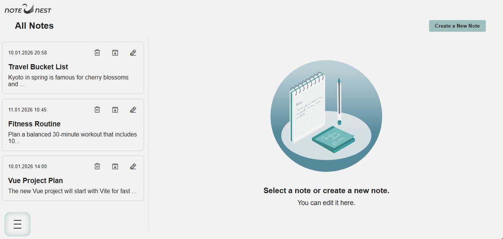
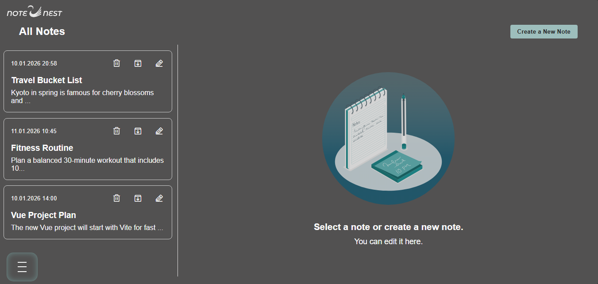
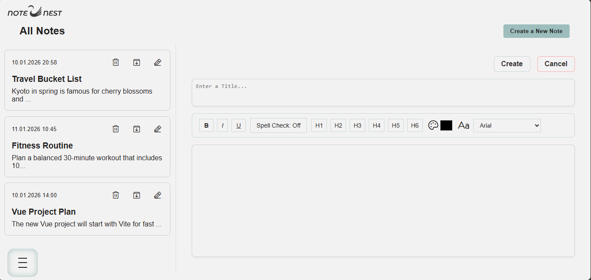
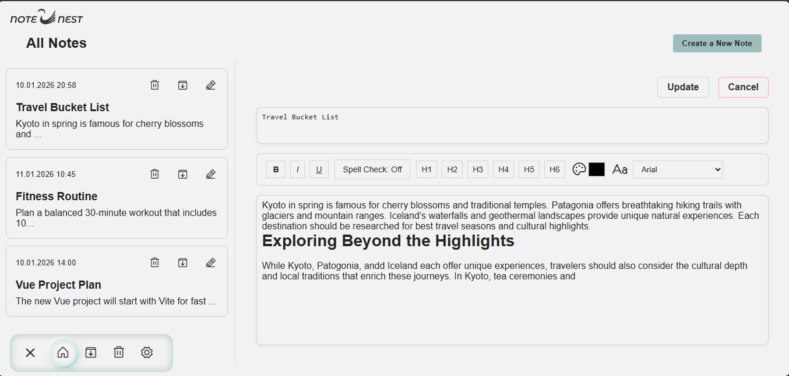
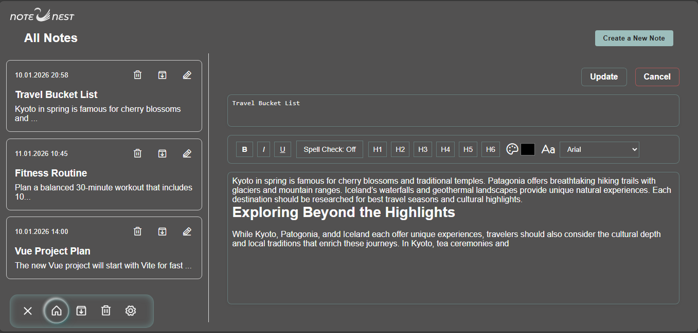
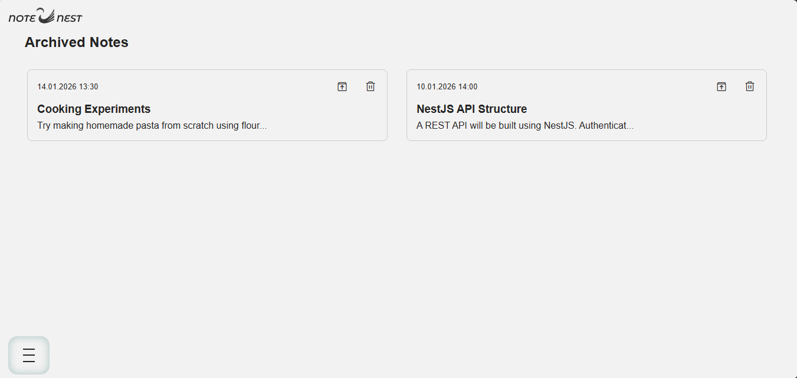
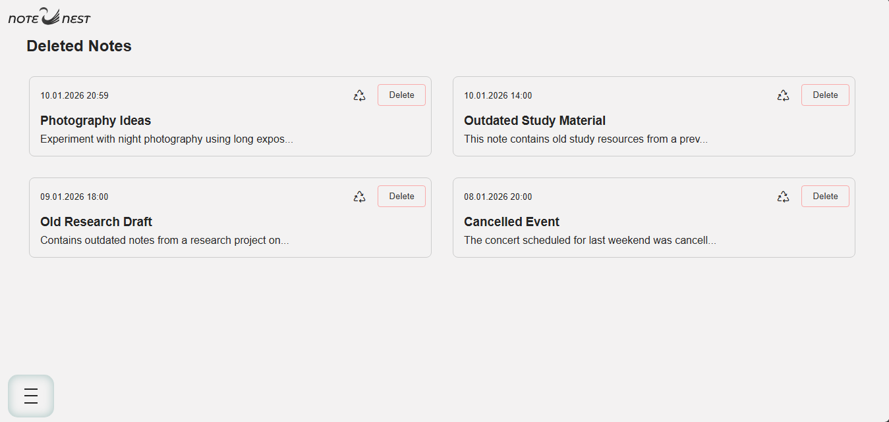
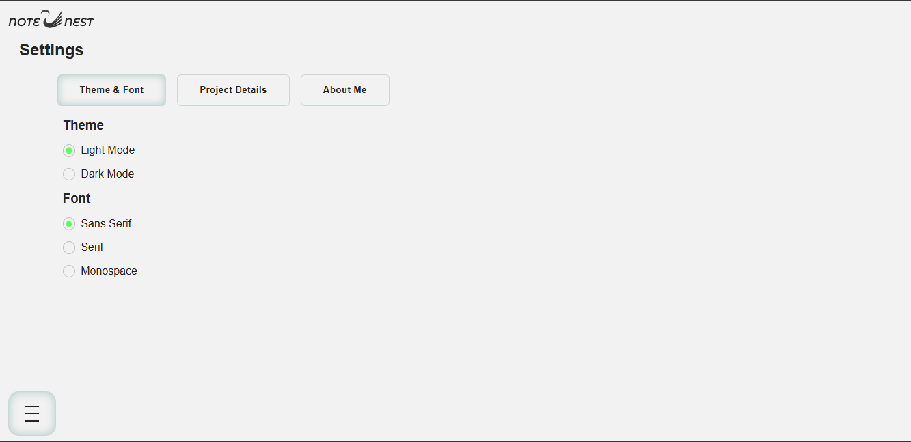

# Note Nest Vue

## Project Details

Note Nest Vue is a sleek, customizable note‑taking app built with Vue 3 & Vite.

Crafted with Vue.js, this app is designed to make note‑taking effortless and highly personal. My goal was to build a space where ideas can be captured, organized, and styled to match your vibe. With customizable themes and fonts, your notes don’t just stay functional—they become part of your creative flow.

It’s designed to make capturing ideas effortless while letting you style your workspace to match your vibe.  

#### Light Mode  

 

#### Dark Mode 

### Features

-  ***Create***, ***edit***, ***delete***, and ***archive*** notes — keep your thoughts organized and accessible.
- **Custom themes** — switch between color palettes to personalize your experience.
- **Font options** — choose between serif, monospace, or sans‑serif to match your style.
- **Responsive design** — optimized layouts for mobile, tablet, and desktop.
- **Validation messages** — clear feedback when required fields are missing.
- **Hover & focus states** — polished UI interactions for a smooth experience.

#### Create New Note - Light Mode
 

#### Edit Note - Light Mode 
 

#### Edit Note - Dark Mode 
 

#### Archived Page - Light Mode 
 

#### Deleted Page - Light Mode 

#### Settings Page - Light Mode 

> <h2>Author</h2> 
 Developed with ❤️ by <a href="https://portfolio-banuaggun.vercel.app/" target="_blank" rel="noopener noreferrer" > Banu Ağgun </a>. Check out the portfolio for more projects and experiments. 
